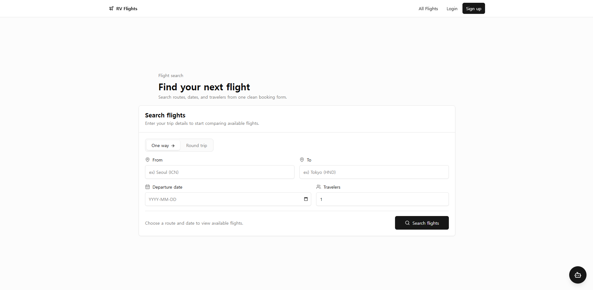
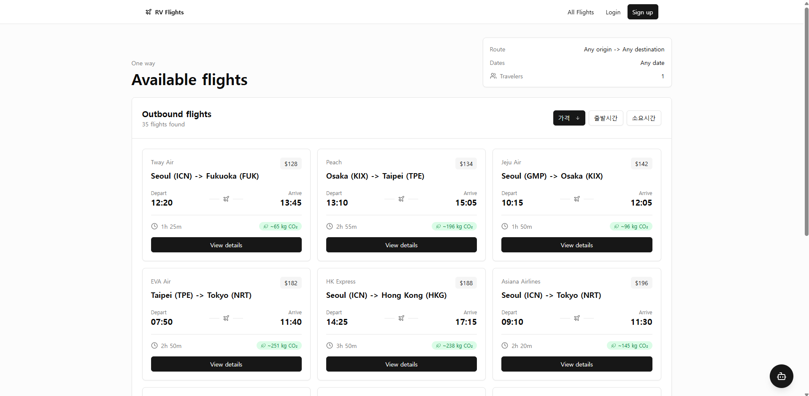
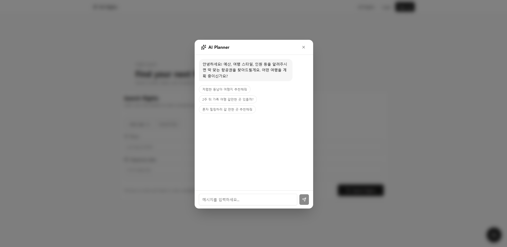
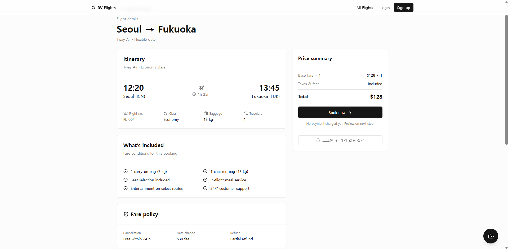
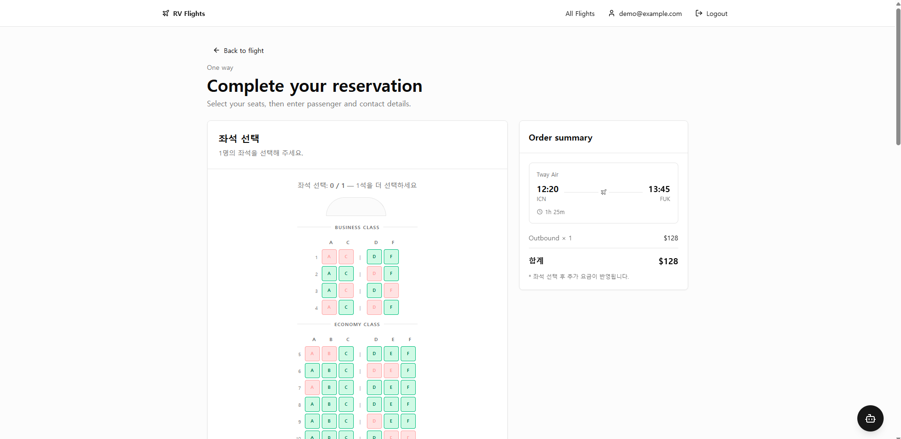
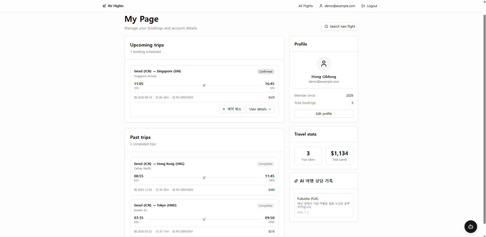
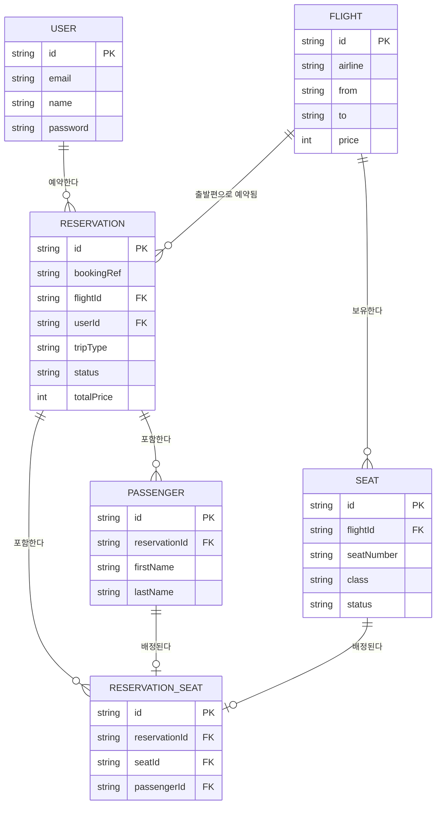

# Booking Flights — 항공권 예약 서비스

## 1. 프로젝트 소개

**프로젝트 이름**: Booking Flights

**한 줄 소개**: 검색부터 좌석 선택, 예약, 가격 예측, AI 여행 상담까지 항공권 예약의 전체 흐름을
Next.js 16의 최신 아키텍처(App Router, Server Components, Server Actions)로 처음부터 끝까지
직접 구현한 풀스택 프로젝트입니다.

**만들게 된 계기**

항공권 예약 서비스는 검색 필터링, 좌석 동시성 처리, 결제 전 단계의 복잡한 상태 관리, 인증/인가
등 실무형 풀스택 애플리케이션의 요구사항을 압축적으로 담고 있는 도메인입니다. Next.js 16에서
바뀐 App Router 관례와 Server Components/Server Actions 중심 설계를 실제 기능 단위로
검증해보고자, 목업이 아닌 실제 DB(Prisma + SQLite)와 트랜잭션 기반 예약 로직을 갖춘 서비스를
단계적으로 완성해나가는 방식으로 진행했습니다.

**기존 항공권 예약 서비스와의 차별점**

- **좌석 단위 동시성 안전성**: 좌석 선택은 단순 UI가 아니라 `$transaction` 내부에서 가용 좌석을
  재확인하는 방식으로 구현해, 두 사용자가 같은 좌석을 동시에 선택하는 race condition을 방지합니다.
- **그라운딩된 AI 추천**: AI 여행 플래너는 LLM이 임의로 지어낸 목적지를 추천하지 않도록, 매 대화마다
  실제 DB에 존재하는 판매 노선과 최저가를 조회해 시스템 프롬프트에 주입한 뒤 그 안에서만 추천하도록
  설계했습니다.
- **투명한 가격 신호**: 45일치 가격 이력을 기반으로 한 매수 타이밍 권고, 날짜별 최저가 히트맵, 목표가
  알림을 통해 "지금 사도 되는지"에 대한 판단 근거를 사용자에게 그대로 보여줍니다.

## 2. 주요 기능

| 기능 | 설명 |
|---|---|
| **AI 여행 상담 (Gemini)** | 예산·인원·스타일을 대화로 파악해 실제 판매 중인 노선 중에서 목적지를 추천하는 챗봇. 추천 확정 시 검색 결과로 바로 연결되고, 대화 요약은 마이페이지에 저장 가능 |
| **항공편 검색** | 출발/도착지, 편도·왕복, 정렬(가격/출발시간/소요시간), 페이지네이션, 날짜 유연 가격 비교 히트맵 |
| **실제 DB 검색 (Prisma)** | 목업 데이터 없이 Prisma ORM으로 SQLite(libSQL)를 직접 조회 — 항공편, 좌석, 가격 이력 모두 실제 테이블 기반 |
| **좌석 선택** | 항공기 좌석 배치를 시각화한 인터랙티브 좌석 맵 (Economy/Business, 비상구 열 표시), 트랜잭션 기반 동시성 처리 |
| **예약** | 편도/왕복 예약, 탑승객 정보 입력, 예약 확정 및 취소(좌석 반환 포함) |
| **마이페이지** | 예약 내역(예정/지난 여정), 가격 알림 현황, AI 상담 기록 조회 |
| **로그인 / 회원가입** | bcrypt 해시 + JWT 세션 쿠키를 직접 구현한 커스텀 인증 (외부 인증 라이브러리 미사용) |
| **가격 예측** | 최근 45일 가격 추이를 분석해 "지금 사는 게 좋을까요?" 형태의 매수 타이밍 권고와 스파크라인 제공 |

## 3. 기술 스택

**Frontend**
- Next.js 16 (App Router, Turbopack)
- React 19 (Server Components 기본)
- TypeScript (strict mode)
- Tailwind CSS v4 + shadcn/ui

**Backend**
- Next.js Server Actions (`app/actions/*.ts`) — 예약, 인증, 가격 알림, AI 상담 저장 등 모든 뮤테이션
- Next.js Route Handlers (`app/api/*`) — 공항 자동완성, AI 플래너 채팅 스트리밍

**Database**
- SQLite (libSQL adapter, `@libsql/client`)
- Prisma 7 ORM

**AI**
- Google Gemini (`@google/genai`) — 스트리밍 응답 + function calling으로 대화에서 검색 조건을 구조화 추출

**Deployment (예정)**
- Vercel (호스팅)
- Turso (호스팅형 libSQL — 코드 변경 없이 `DATABASE_URL` 교체만으로 전환 가능)

## 4. 프로젝트 구조

```
app/                     # 라우트 (App Router)
  page.tsx                # 홈 — 항공권 검색 폼
  search/                 # 검색 결과, 날짜 유연 가격 비교
  flights/[id]/           # 항공편 상세, 가격 예측, 탄소 배출량
  reservation/             # 예약 페이지 (좌석 선택 포함)
  mypage/                 # 예약 내역, 가격 알림, AI 상담 기록
  login/ signup/           # 인증
  actions/                # Server Actions — DB를 변경하는 모든 로직
  api/                    # Route Handlers — 공항 자동완성, AI 플래너 채팅

components/               # 화면을 구성하는 UI 컴포넌트
  seat-selector.tsx         # 좌석 맵
  reservation-form.tsx      # 예약 폼
  ai-planner-fab.tsx        # AI 여행 플래너 채팅창
  price-prediction.tsx      # 가격 예측 카드
  ui/                      # shadcn/ui 기본 컴포넌트

lib/                      # 공용 로직
  prisma.ts                # Prisma 클라이언트 싱글톤
  auth.ts session.ts password.ts   # 인증 (DAL, JWT 세션, bcrypt)
  airports.ts               # 공항 좌표, 거리·탄소 배출량 계산

prisma/                   # 스키마, 마이그레이션, 시드 데이터
```

## 5. 주요 화면

> 스크린샷은 `docs/screenshots/` 경로에 추가한 뒤 아래 링크를 채워주세요.

| 화면 | 설명 |
|---|---|
| Home |  |
| Search |  |
| AI Chat |  |
| Flight Detail |  |
| Reservation |  |
| My Page |  |

## 6. 실행 방법

```bash
# 1. 의존성 설치
npm install

# 2. 환경 변수 설정
cp .env.example .env
# .env에서 DATABASE_URL, SESSION_SECRET(필수) / GEMINI_API_KEY(선택) 값 입력

# 3. DB 마이그레이션 & 시드
npx prisma migrate dev
npx prisma db seed

# 4. 개발 서버 실행
npm run dev
```

`http://localhost:3000`에서 확인할 수 있으며, `demo@example.com` / `demo4321` 계정으로
시드된 예약 내역을 바로 확인할 수 있습니다.

## 7. 데이터베이스 (ERD)



> `Reservation`과 `Seat`은 직접 연결되지 않고, 좌석별 승객 배정을 표현하는 `ReservationSeat`
> 조인 테이블을 통해 연결됩니다. 이 밖에 가격 알림(`PriceAlert`), 가격 이력(`FlightPriceHistory`),
> AI 상담 기록(`PlannerConversation`) 테이블도 있으며 전체 스키마는 [CLAUDE.md](./CLAUDE.md)를
> 참고해주세요.

## 8. 개발 과정

마이그레이션 이력 기준으로 다음 순서로 발전했습니다.

1. **UI & DB 기반 구축** — 검색 폼, 항공편 목록, `User`/`Flight`/`Reservation`/`Passenger`
   핵심 스키마와 예약 생성 흐름
2. **좌석 선택** — `Seat` 모델 추가, 시각적 좌석 맵과 트랜잭션 기반 동시성 처리
3. **가격 예측** — `FlightPriceHistory` 모델 추가, 45일치 가격 이력 기반 매수 타이밍 권고
4. **인증** — `User.password` 추가, bcrypt + JWT 세션으로 로그인/회원가입/보호된 라우트 구현
5. **편도/왕복 예매 확장** — 왕복 검색·예약 흐름과 관련 스키마 필드 추가
6. **가격 알림** — 목표가 도달 시 트리거되는 `PriceAlert` 기능
7. **AI 여행 상담 & 탄소 배출량** — Gemini 기반 대화형 플래너(function calling, DB 그라운딩)와
   구간 거리 기반 탄소 배출량 표시를 추가하고, 상담 결과를 마이페이지에 저장하는 기능으로 마무리

## 9. 트러블슈팅

- **Prisma `prisma-client` 제너레이터 + Turbopack 캐시 불일치**: 이 프로젝트는 `prisma-client-js`가
  아닌 신형 `prisma-client` 제너레이터를 사용합니다. 스키마 변경 후 `prisma generate`만으로는
  Turbopack이 이전 클라이언트 타입을 계속 캐시하는 경우가 있어, `.next` 캐시를 함께 삭제하는
  절차를 정례화했습니다.
- **libSQL의 `createMany({ skipDuplicates })` 미지원**: PostgreSQL/MySQL과 달리 libSQL 어댑터는
  이 옵션을 지원하지 않아, 시드 스크립트에서 삽입 전 `count` 조회로 중복 여부를 직접 판별하도록
  우회했습니다.
- **좌석 동시 예약 race condition**: 두 사용자가 같은 좌석을 동시에 선택해 예약을 시도할 수 있는
  경우를 막기 위해, 예약 생성을 `$transaction` 안에서 가용 좌석을 재확인하는 방식으로 구현하고
  충돌 시 `SEATS_TAKEN` 에러로 명시적으로 처리했습니다.
- **AI 응답의 목적지 환각(hallucination) 방지**: LLM이 실제로 판매하지 않는 목적지를 추천하는
  문제를 막기 위해, 매 요청마다 Prisma로 실제 노선·최저가를 조회해 시스템 프롬프트에 주입하고
  `propose_flight_search` function calling으로 응답을 구조화해 검증 가능하게 만들었습니다.
- **Next.js 16의 `middleware.ts` deprecation**: 신규 컨벤션인 `proxy.ts`로 전환하면서, 쿠키
  디코딩만 수행하는 옵티미스틱 체크와 각 페이지의 실제 DB 기반 인증 체크(`getCurrentUser`)를
  역할 분리했습니다.

## 10. 향후 개선 사항

- **실시간 가격 예측 고도화** — 현재는 시드된 45일 정적 이력 기반 추이 분석. 실시간 가격 피드
  연동 시 더 정교한 예측 모델 적용 가능
- **항공사 API 연동** — 현재는 자체 DB 기반 목업 항공편. 실제 GDS/항공사 API 연동 시 실시간
  좌석/가격 반영 가능
- **즐겨찾기** — 관심 노선/목적지를 저장하고 마이페이지에서 모아보는 기능
- **다국어 지원** — 현재 한국어/영어가 혼재된 UI를 i18n 체계로 정리
- **배포 환경 구성** — Vercel + Turso로 실제 서비스 배포 (현재 로컬 개발 환경까지만 구현)
- **이메일 발송 / 비밀번호 재설정** — 예약 확인 메일, 가격 알림 메일, 비밀번호 재설정 플로우
- **왕복 예약 세분화** — 귀환편 좌석 선택, 편도 단위 부분 취소 지원
